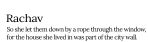
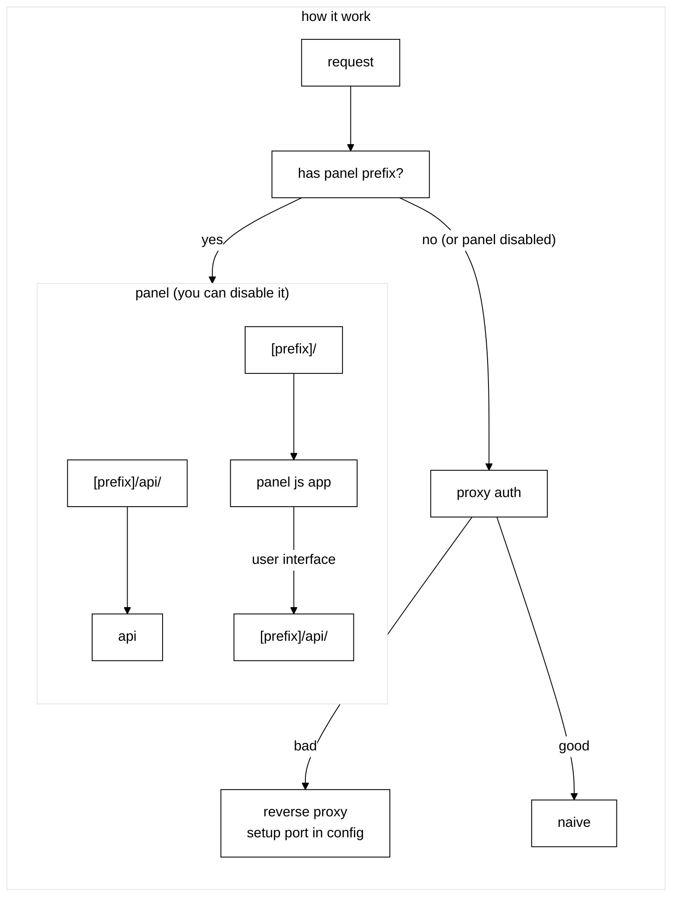

<div align="center">
       
    <picture>
      <source media="(prefers-color-scheme: dark)" srcset="images/rachav-dark.svg">
      <source media="(prefers-color-scheme: light)" srcset="images/rachav-light.svg">
      
    </picture>
    <br>
    <br>
</div>

# Rachav
easy naive proxy setup and dashboard

It just helps you:
- generate configs
- run naiveproxy
- manage certificates
- use a simple web dashboard
- avoid unnecessary pain

# AI disclaimer
Frontend is heavily vibe-coded.

Some backend/proxy handler code also contains AI-assisted code.

This project is still an MVP and currently focused on: making things work properly first :)

I don’t like AI-generated code, even though I use it sometimes. In the distant plans, I want to remove all AI-written code from this repo.


# So, how to run

Place the `bin` and `naive` files in any directory and run it...

On the first launch, it will automatically generate a `config.yaml` file, change it)


## How it works

When started, `rachav` tries to launch 
`./naive`
binary (NaiveProxy) from the current working directory.
```
Minimal directory structure:
├── naive
└── rachav
```

Where:
- `rachav` → rachav binary
- `naive` → NaiveProxy binary

Make sure both files exist in the same directory and have execution permissions.

If not, run:
```bash
chmod +x ./rachav
chmod +x ./naive
```

You can run it in background using nohup:
```bash
nohup ./rachav &
```
Or you can create a service (just google how to do it, it's not hard).

todo: create auto installation script


